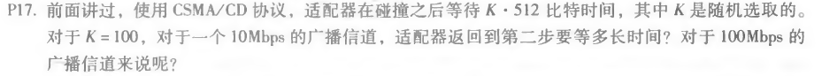
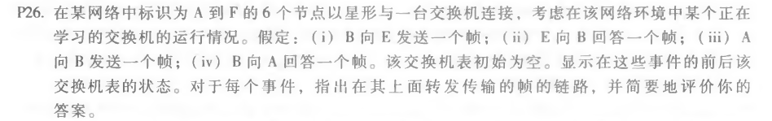

###### 2017301530080 王润泽

---

### P17

对于10Mbps的广播信道，需要的时间是： $ \frac{51200bit} {10 \times 10 ^ 6 bps} = 5.12ms $ 

 对于100Mbps的广播信道，需要的时间是： $0.512ms $ 

---

### P18

| 时间t | 时间      |
| ----- | --------- |
| 0     | A开始传输 |
| 324   | B开始传输 |
| 576   | A传输完成 |
| 649   | B到达A    |

最坏的情况下，B在324比特时间开始传输，而A在576完成传输。

B的信号未能在576比特时间之前道道A，因此A能完成传输

---

### P26

| 原节点 | 目的节点 | 交换机表的状态                             | 传输的帧的链路 | 说明                                                       |
| ------ | -------- | ------------------------------------------ | -------------- | ---------------------------------------------------------- |
| B      | E        | 添加B的mac地址和接口及发送时间到交换机表中 | 广播到ACDEF    | 交换机表没有B和E的信息，所以要添加B的地址/接口，且广播改帧 |
| E      | B        | 添加E的mac地址和接口及发送时间到交换机表中 | B              | 交换机表中已有B的mac地址和接口信息                         |
| A      | B        | 添加A的mac地址和接口及发送时间到交换机表中 | B              | 交换机表中已有B的mac地址和接口信息                         |
| B      | A        | 更新B节点的发送时间                        | A              | 交换机表中已有A的mac地址和接口信息                         |