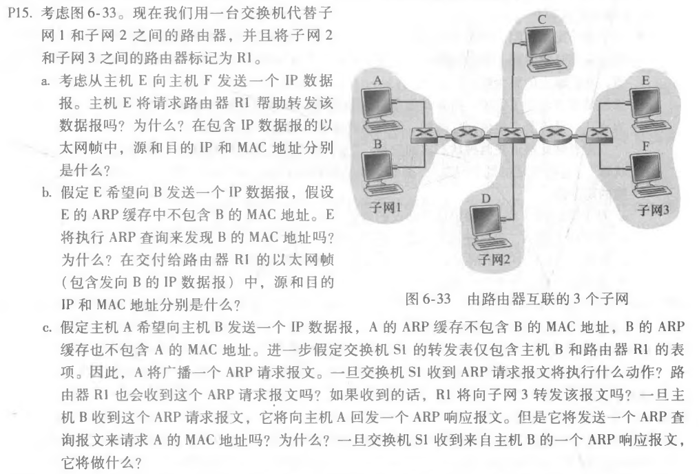
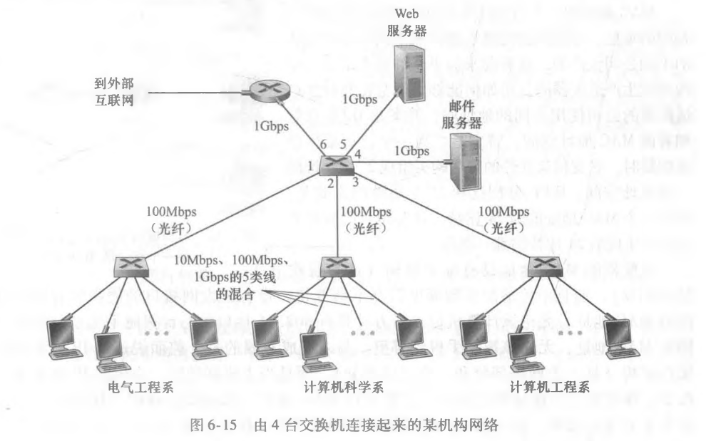
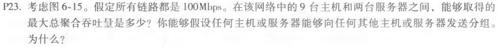
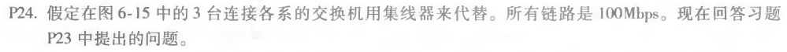

### 第十二次作业

* * *

#### P15

##### 题目：

##### 作答：
a. E不会将数据包发送到默认路由器R1。

因为E会通过检查主机F的IP地址的⼦网前缀，从而得知F在同⼀个局域网上。

以太网帧：

源IP = E的IP地址

目的IP = F的IP地址

源MAC = E的MAC地址

目的MAC = F的MAC地址

b. 不会。

因为E可以通过检查B的IP地址来得知它们不在同⼀个局域网上。

以太网帧：

源IP = E的IP地址

目的IP = B的IP地址

源MAC = E的MAC地址

目的MAC = 连接到⼦网的R1接口的MAC地址

c. 交换机S1将通过两个接口⼴播以太网帧，因为接收到的ARP帧的目标地址是⼴播地址。它得知A保留在连接到⼦网1的⼦网1上，并且S1将更新它的转发表以包括主机A的表项。

路由器R1也会受到这个ARP请求报文。

R1不会将报文转发到⼦网3。

B不会发送请求A的MAC地址的ARP查询报文，因为这个地址可以从A的查询报文中获得。

⼀旦交换机S1收到来自主机B的响应报文，它将在其转发表中为主机B添加⼀个表项，然后删除接收到的帧，因为目标主机A与主机B在同⼀个接口上。

* * *

#### P23

##### 题目：

##### 作答：
既然所有链路都是100Mbps，一共11台主机若以100Mbps的最大速率发送数据

则最大总聚合吞吐量为 11 * 100Mbps = 1100Mbps

* * *

#### P24

##### 题目：

##### 作答：
每个机构中心都是⼀个冲突域，最大吞吐量为100Mbps。

而连接Web服务器和邮件服务器的链接的最大吞吐量也分别为100Mbps。

三个冲突域和Web服务器和邮件服务器分别以100Mbps的最大速率发送数据

则最大总聚合吞吐量为 5 * 100Mbps = 500Mbps

* * *
