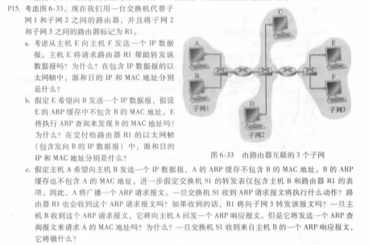
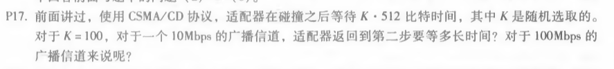
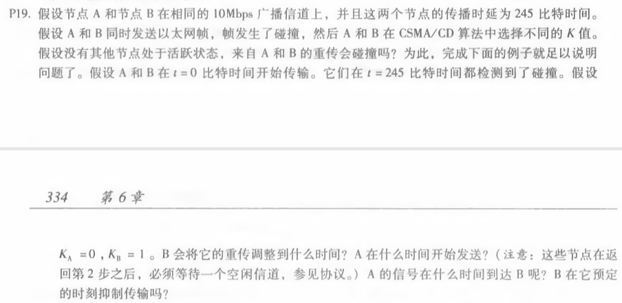

# 网络及分布式计算第十二次作业

#### 2017302580018  刘佳媚

---

### 1、P15

  解：

a、否。E可以检查主机F的IP地址的⼦⽹前缀，然后知道F在同⼀个局域⽹上。因此，E不会将数据包发送到默认路由器R1。从E到F的以太⽹帧中，源IP是E的IP地址，⽬的IP是F的IP地址，源MAC是E的MAC地址，⽬的MAC是F的MAC地址。

b、否。因为它们不在同⼀个局域⽹上，E可以通过检查B的IP地址来发现这⼀点。从E到R1的以太⽹帧中，源IP是E的IP地址，⽬的IP是B的IP地址，源MAC是E的MAC地址，⽬的MAC是连接到⼦⽹的R1接⼝的MAC地址。

c、交换机S1将进行⼴播。路由器R1也会接收这个ARP请求消息，但是R1不会将报文转发到⼦⽹3。B不会发送请求A的MAC地址的ARP查询消息，因为这个地址可以从A的查询消息中获得。交换机S1接收到B的响应消息，它将向A转发该报文，并在其转发表中为主机B添加⼀个条⽬。

------

### 2、P17

  解：对于10Mbps：t1 = 5.12*10^4bits / 10Mbps = 5.12ms

​         对于100Mbps：t2= 5.12*10^4bits / 100Mbps = 0.512ms

------

### 3、P19

  解：

| 时间（比特时间） | 事件                                          |
| ---------------- | --------------------------------------------- |
| 0                | A和B开始传输                                  |
| 245              | A和B检测碰撞                                  |
| 293              | A和B结束拥塞信号传输，因为KA=0，A开始侦听信道 |
| 538              | B的最后一比特到达A，A检测空闲线路             |
| 634              | A发现信道都处于空闲，开始发送以太网帧         |
| 805              | B对空闲信道进行检测                           |
| 879              | A传送的以太网帧到达B                          |

因为B的预定重传时间是805+96=901比特时间，而A在634比特时间时开始发送，879比特时间到达了B。在805比特时间，B侦听到A在传送，会抑制传输。，
