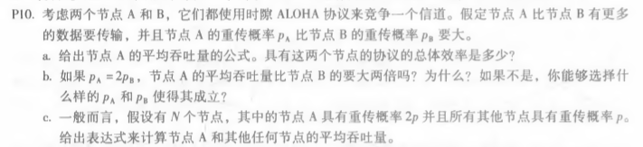
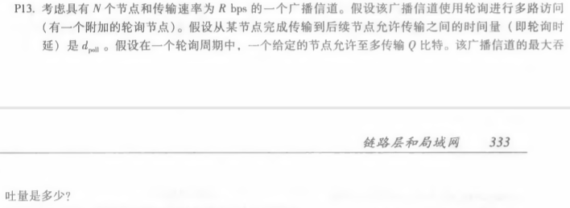
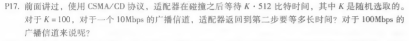

# Homework12

​										*马克*

#### 计算机网络（自顶向下）中文版第6章习题练习（电子版p349起，纸质版p331起）

###### 1，p10

答：a）A的吞吐量：PA（1-PB），总体效率：PA(1-PB)PB(1-PA)

b）A的吞吐量为PA(1-PB)=2PB(1-PB)=2PB-2PB^2,B的吞吐量为PB(1-PA)=PB(1-2PB)=PB-2PB^2，A的吞吐量不是B的两倍。

要让A为B的两倍，则：PA(1-PB)=2PB(1-PA)，推出：PAPB+PA-2PB=0

c）A的吞吐量为2P(1-P)N1，其他任何节点的吞吐量为P(1-P)N-2(1-2P)

###### 2，p13

答：轮询长度为N(Q/R+d_poll)

在轮询中，传输的比特数为NQ

最大吞吐量为：NQ/[N(Q/R+d_poll)]=Q/(Q/R+d_poll)

###### 3，p17

答：10Mbps的广播信道：等待51.2\*10^3/(10\*10^6)=5.12ms

对于100Mbps，等待时间为512微秒