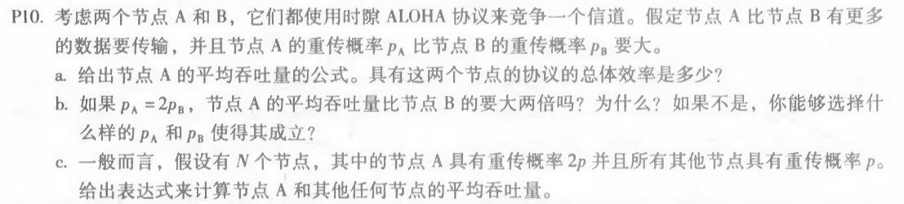
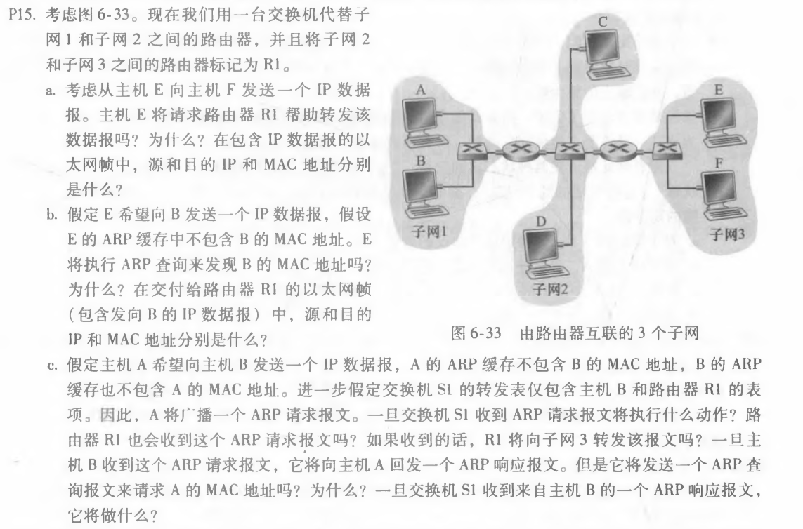
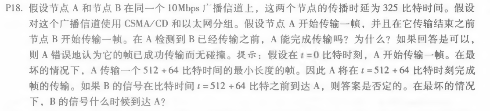

# 网络及分布式计算第十二次作业

计算机学院-刁可 -2017302580031

1. P10

   

   a. A的平均吞吐量为pA(1-pB)。则具有这两个节点的协议的总效率为pA(1-pB)+pB(1-pA)。

   b. A的吞吐量为pA(1-pB)=2pB(1-pB)，B的吞吐量为pB(1-pA)=pB(1-2pB)，由此可得A的吞吐量不比B的大两倍，若条件成立，则pA(1-pB) = 2pB(1-pA)，即为pA+pApB-2pB = 0

   c. A的吞吐量为2p(1-p)N-1，任何其他节点的平均吞吐量为p(1-p)N-2(1-2p)。

2.  P15

   

   a. 不，二者在同一子网中，E可以检查主机F的IP地址的子网前缀，然后了解F在同一个局域网上。因此，E不会将数据包发送到默认路由器R1。源IP地址：E的IP地址，目的IP地址：F的IP地址，源MAC地址：E的MAC地址，目的MAC地址：F的MAC地址。

   b. 不，因为它们不在同一个局域网上。E可以通过检查B的IP地址来发现这一点。源IP地址：E的IP地址，目的IP地址：B的IP地址，源MAC地址：E的MAC地址，目的MAC地址：R1与子网3的接口的MAC地址。

   c. S1将继续广播，R1会收到ARP请求报文，R1不会向子网3转发该报文，B不会发送ARP查询报文，因为它从A发送的查询报文中可以获得A的MAC地址，S1将在转发表中加入B的地址，并向A转发该报文。

3.  P18

   

   在t=0时A发射。在t=576时，A将完成传输。在最坏的情况下，B在时间t=324开始发送，即A的第一个帧到达B之前的时间。在时间t=324+325=649时，B的第一个比特到达A时，A在检测到B已经发送之前就完成了传输，所以A能完成传输。