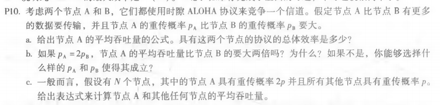
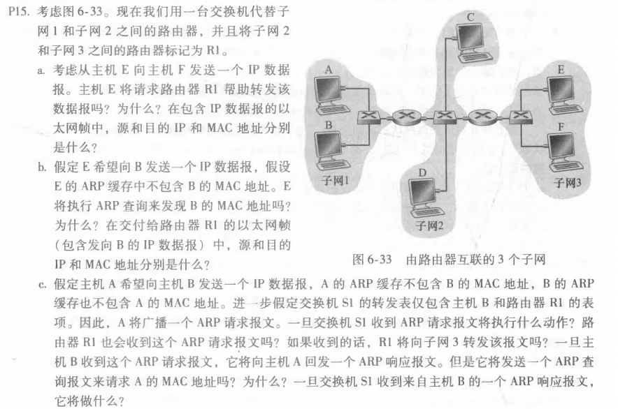
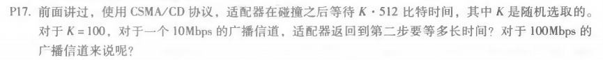

### Chapter 6 (p10, p15, p17)

******

a.
  节点A的平均吞吐量：PA(1 − PB)
  总体效率：PA(1 − PB) + PB(1 − PA)

b.
  如果：PA=2PB
  => A的吞吐量：PA(1 − PB) = 2PB(1 − PB) = 2PB − 2PB^2
  => B的吞吐量：PB(1 − PA) = PB(1 − 2PB) = PB − 2PB^2
  显然节点A的平均吞吐量比节点B的要大两倍不成立
  令 PA(1 − PB) = 2PB(1 − PA) ，解得 PA= 2PB / (PB + 1)

c.
  A的吞吐量：2p(1 − p)N − 1，
  任何其他节点的吞吐量： p(1 − p)N − 2(1 − 2p)

******

a.
  不会请求转发。E可以检查主机F的IP地址的⼦⽹前缀，然后知道F在同⼀个局域⽹上。因此，E不会将数据包发送到默认路由器R1。从E到F的以太⽹帧中，源IP是E的IP地址，⽬的IP是F的IP地址，源MAC是E的MAC地址，⽬的MAC是F的MAC地址。
b.
  不会执行。因为它们不在同⼀个局域⽹上，E可以通过检查B的IP地址来发现这⼀点。从E到R1的以太⽹帧中，源IP是E的IP地址，⽬的IP是B的IP地址，源MAC是E的MAC地址，⽬的MAC是连接到⼦⽹的R1接⼝的MAC地址。
c.
  交换机S1将进行⼴播。路由器R1也会接收这个ARP请求消息，但是R1不会将报文转发到⼦⽹3。B不会发送请求A的MAC地址的ARP查询消息，因为这个地址可以从A的查询消息中获得。交换机S1接收到B的响应消息，它将向A转发该报文，并在其转发表中为主机B添加⼀个条⽬。

******

- 对于10Mbps：T = 5.12*10^4bits / 10Mbps = 5.12ms

- 对于100Mbps：T= 5.12*10^4bits / 100Mbps = 0.512ms