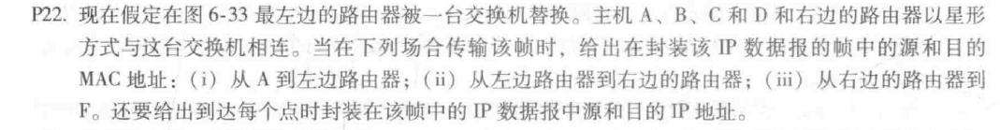
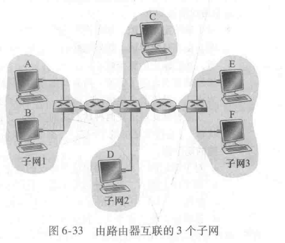
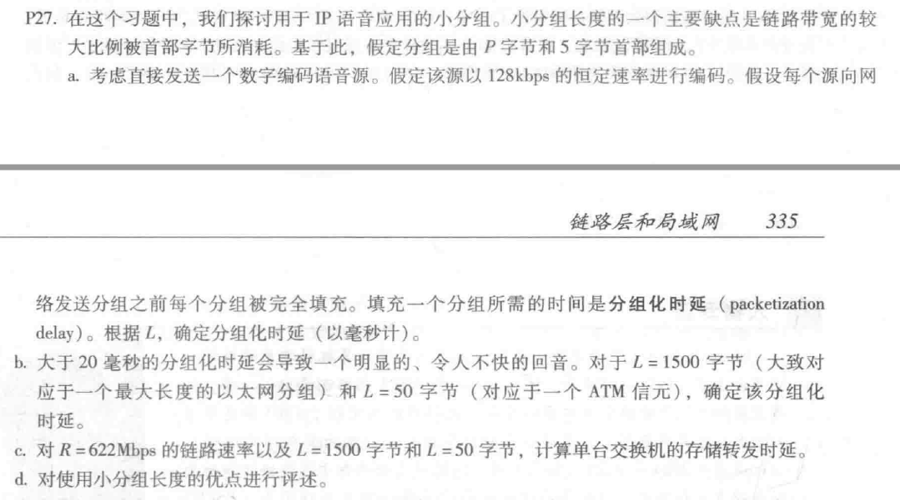
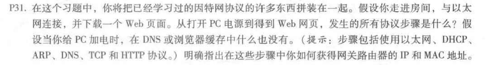

# 第12次作业

Author：陈俊杰

StuNo:  2017302580109

选取第六章——链路层的部分习题：

> + P22
>
>  
>
> 图6-33如图：
>
> 
>
> i) 从A到交换机：
>
>    源MAC地址：00-00-00-00-00-00 
>
>    目的地MAC地址：55-55-55-55-55-55 
>
>    源IP：111.111.111.001 
>
>    目的地IP：133.333.333.003 
>
> ii) 从交换机到右路由器：
>
>    源MAC地址：00-00-00-00-00-00
>
>    目的地MAC地址: 55-55-55-55-55-55 
>
>    源IP: 111.111.111.001 
>
>    目的地IP: 133.333.333.003 
>
> iii) 从右路由器到F：
>
>    源MAC地址: 88-88-88-88-88-88 
>
>    目的地MAC地址: 99-99-99-99-99-99 
>
>    源IP: 111.111.111.001 
>
>    目的地IP: 133.333.333.003 
>
> 

>+ P27
>
>  
>
>  解答如下：
>
>  
>
>

> + P31：
>
> 
>
> 首先是设备接入以太网，需要使用**DHCP协议**获取自己的IP地址。DHCP发现阶段，本主机创建一个IP地址为255.255.255.255的数据报，将其封装在以太网帧中，在以太网中进行广播。对应DHCP服务器接收到此数据报之后，将分配的IP地址、第一跳路由器IP、子网掩码等信息所在的数据报封装在帧中，一样进行广播。本主机接收到这个数据报之后，再对DHCP发送请求，DHCP回复ACK。此后本主机就获得了一个一定时限的IP地址。
>
> 此后，需要使用**ARP协议**获取第一跳路由器和本地DNS服务器的MAC地址。本主机需要获得目标页面的IPD地址，此时需要用到**DNS协议**将域名转化为IP地址。首先查询浏览器缓存，如果没有查到，则查找本机HOST缓存，如果HOST缓存中也没有，则查询路由器缓存，再没查到就去查询本地DNS服务器，再没查到就去顶级DNS服务器和根DNS服务器进行递归查询或者迭代查询了。
>
> 获取到IP地址之后，本主机会通过第一跳路由器发送HTTP请求，HTTP请求被传输层分割，装进TCP数据报里面，再通过网络层，封装在IP数据报，最后封装在链路层的以太网帧中。本主机将以太网帧发送到第一跳路由器，如果路由器接收到，就将其传送到网络层，检查路由表，然后将数据包从对应的输入端口发送到指定的输出端口。
>
> 此后，IP数据报会通过互联网发到Web服务器，web服务器通过上面类似的过程，将网页文件通过层层封装，发送回本主机。这个过程中，传输层的TCP还会进行三次握手和四次挥手的可靠性验证操作，以确保数据报能正确发送到本主机上。

