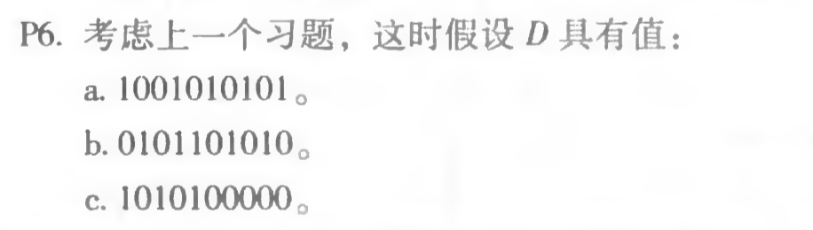
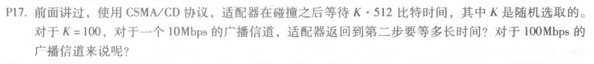
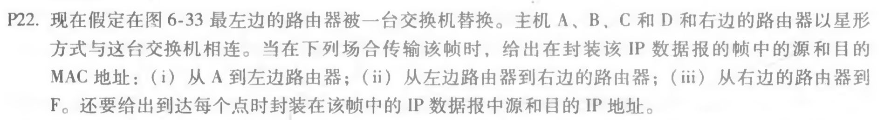

## 第十二次作业

------

### 1. P6

a) 得到1000110000，剩余R=0000

b) 得到0101010101，剩余R=1111

c) 得到1011010111，剩余R=1001

------

### 2. P17

10Mbps时，等待时间为5.1210^4/10*10^6 = 5.12ms

100Mbps时，等待时间为5.1210^4/100*10^6 = 0.512ms

------

### 3. P22

i) 从A到左边路由器：

源MAC地址：00-00-00-00-00-00

目的MAC地址：55-55-55-55-55-55

源IP：111.111.111.001

目的IP：133.333.333.003

ii) 从左边路由器到右边路由器：

源MAC地址：00-00-00-00-00-00

目的MAC地址: 55-55-55-55-55-55

源IP: 111.111.111.001

目的IP: 133.333.333.003

iii) 从右边的路由器到F：

源MAC地址: 88-88-88-88-88-88

目的MAC地址: 99-99-99-99-99-99

源IP: 111.111.111.001

目的IP: 133.333.333.003