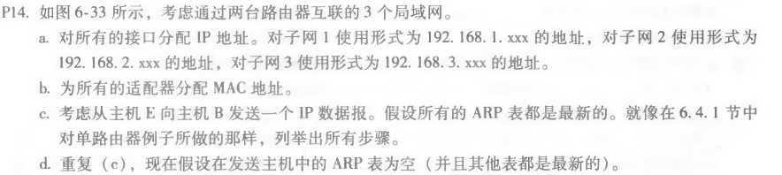
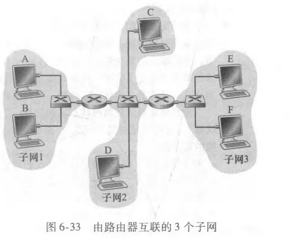
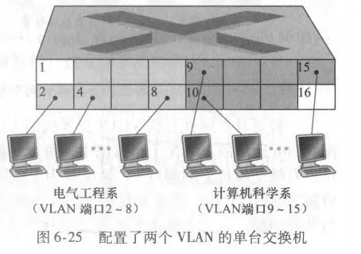
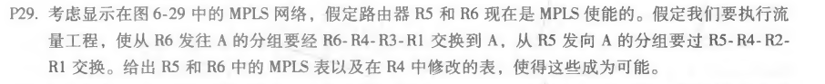
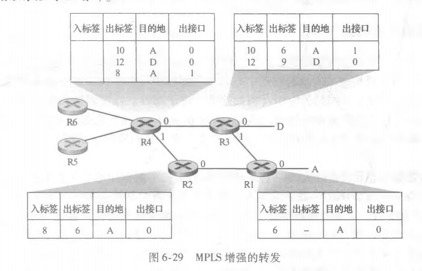

## 第12次作业


### p14





a.

| 接口                    | IP            |
| ----------------------- | ------------- |
| A                       | 192.168.1.001 |
| B                       | 192.168.1.002 |
| 子网1-子网2连接的适配器 | 192.168.1.003 |
| C                       | 192.168.2.001 |
| D                       | 192.168.2.002 |
| 子网2子网1连接的适配器  | 192.168.2.003 |
| 子网2子网3连接的适配器  | 192.168.2.004 |
| E                       | 192.168.3.001 |
| F                       | 192.168.3.002 |
| 子网3子网2连接的适配器  | 192.168.3.003 |

B.

| 接口                    | MAC                  |
| ----------------------- | -------------------- |
| A                       | 00-00-00-00-00-00-00 |
| B                       | 11-11-11-11-11-11-11 |
| 子网1-子网2连接的适配器 | 22-22-22-22-22-22-22 |
| C                       | 33-33-33-33-33-33-33 |
| D                       | 44-44-44-44-44-44-44 |
| 子网2子网1连接的适配器  | 55-55-55-55-55-55-55 |
| 子网2子网3连接的适配器  | 66-66-66-66-66-66-66 |
| E                       | 77-77-77-77-77-77-77 |
| F                       | 88-88-88-88-88-88-88 |
| 子网3子网2连接的适配器  | 99-99-99-99-99-99-99 |

C.

1. E中的转发表确定数据报应路由到接口192.168.3.002。

2. E中的适配器创建具有以太网目的地地址88-88-88-88-88-88-88的以太网数据包。

3. 路由器2接收数据包并提取数据报。此路由器中的转发表指示数据报将被路由到198.162.2.002。

4. 路由器2然后通过其与IP地址198.162.003的接口发送目的地址为33-33-33-33-33-33-33-33和源地址为55-55-55-55-55-55-55-55-55-55的以太网分组。

5. 这一过程一直持续到数据包到达主机B为止。

D.

E中的ARP现在必须确定198.162.3.002的MAC地址。主机E在广播以太网帧内发送ARP查询包。路由器2接收查询包并向主机E发送ARP响应包。此ARP响应包由以太网帧承载，以太网目的地地址为77-77-77-77-77-77-77-77。


### p28




```
EE部门这三台计算机(从左到右)的IP地址是：111.111.1.1、111.111.1.2、111.111.1.3。子网掩码为111.111.1/24。
CS部门这三台计算机(从左到右)的IP地址是：111.111.2.1、111.111.2.2、111.111.2.3。子网掩码为111.111.2/24。

连接到端口1的路由器接口卡可以配置为包含两个子接口IP地址：111.111.1.0和111.111.2.0。第一种是针对EE部门的子网，第二种是针对CS部门的子网。每个IP地址都与VLAN ID相关联。假设111.111.1.0与VLAN 11相关联，111.111.2.0与VLAN 12相关联。这意味着来自子网111.111.1/24的每一帧将被添加一个带有VLAN ID 11的802.1q标记，而来自111.111.2/24的每一帧将被添加一个带有VLAN ID 12的802.1q标记。

假设EE部门中具有IP地址111.111.1.1的主机A希望向CS部门中的主机B(111.111.2.1)发送IP数据报。主机A首先将IP数据报(目的地为111.111.2.1)封装到具有与连接到交换机端口1的路由器接口卡的MAC地址相等的目标MAC地址的帧中。一旦路由器接收到该帧，然后将其传递到IP层，该层决定通过子接口111.111.2.0将IP数据报转发到子网111.111.2/24。然后路由器将IP数据报封装成一个帧并发送到端口1。请注意，该帧有一个802.1q标记VLAN ID 12。一旦交换机接收到帧端口1，它就知道该帧被发送到ID为12的VLAN，因此交换机将该帧发送到位于CS部门的主机B。一旦主机B接收到此帧，它将删除802.1q标记。
```


### p29





R5的MPLS表

| in label | out label | dest | out insert |
| -------- | --------- | ---- | ---------- |
|          | 2         | D    | 0          |

R6的MPLS表

| in label | out label | dest | out insert |
| -------- | --------- | ---- | ---------- |
|          | 3         | D    | 0          |

R4

| in label | out label | dest | out insert |
| -------- | --------- | ---- | ---------- |
| 3        | 12        | D    | 0          |
| 2        | 3         | D    | 1          |