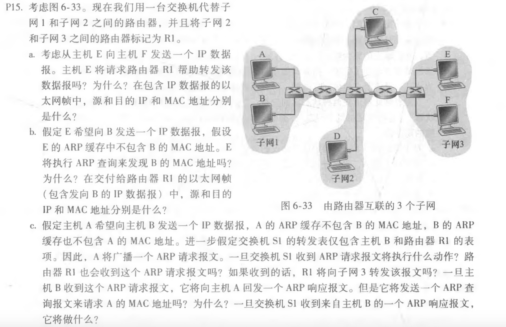
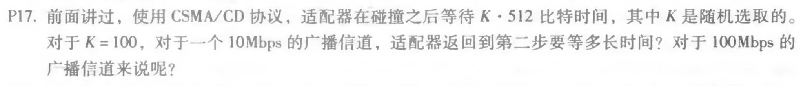
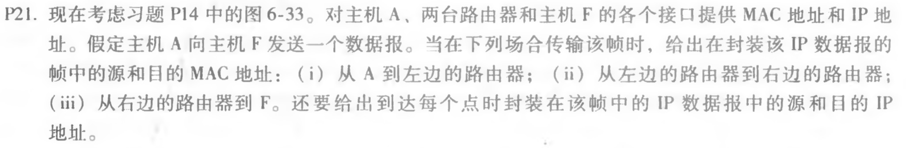

## 第六章习题

a. 主机E向F发送IP数据报不需要请求路由器R1转发，因为E和F在同一个子网中。

| 源IP地址  | 目的IP地址 | 源MAC地址  | 目的MAC地址 |
| --------- | ---------- | ---------- | ----------- |
| E的IP地址 | F的IP地址  | E的MAC地址 | F的MAC地址  |

b. 主机E向B发送一个IP数据报，E不能执行ARP查询B的MAC地址，因为B和E不在同一个局域网内，ARP查询只能查询同一个局域网内的MAC地址。

| 源IP地址  | 目的IP地址 | 源MAC地址  | 目的MAC地址            |
| --------- | ---------- | ---------- | ---------------------- |
| E的IP地址 | B的IP地址  | E的MAC地址 | R1与子网3接口的MAC地址 |

c. A广播一个ARP请求报文，交换机S1收到后将继续广播，路由器R1会收到这个ARP请求报文，但是R1不会向子网3继续转发了。主机B收到请求后，不用再查询A的MAC地址了，因为A的查询报文中就包含了A的MAC地址。交换机S1收到B的响应报文后将向A转发该报文，并且在转发表中加入B的地址。

对于10Mbps的广播信道：K\*512/10\*10^6 = 100\*512/10\*10^6 = 5.12ms

对于100Mbps的广播信道：K\*512/100\*10^6 = 100\*512/100\*10^6 = 0.512ms

(1)

| 源IP地址  | 目的IP地址 | 源MAC地址  | 目的MAC地址                    |
| --------- | ---------- | ---------- | ------------------------------ |
| A的IP地址 | F的IP地址  | A的MAC地址 | 左边路由器与子网1接口的MAC地址 |

(2)

| 源IP地址  | 目的IP地址 | 源MAC地址                      | 目的MAC地址                         |
| --------- | ---------- | ------------------------------ | ----------------------------------- |
| A的IP地址 | F的IP地址  | 左边路由器与子网1接口的MAC地址 | 左边路由器与右边路由器接口的MAC地址 |

(3)

| 源IP地址  | 目的IP地址 | 源MAC地址                      | 目的MAC地址 |
| --------- | ---------- | ------------------------------ | ----------- |
| A的IP地址 | F的IP地址  | 右边路由器与子网3接口的MAC地址 | F的MAC地址  |

