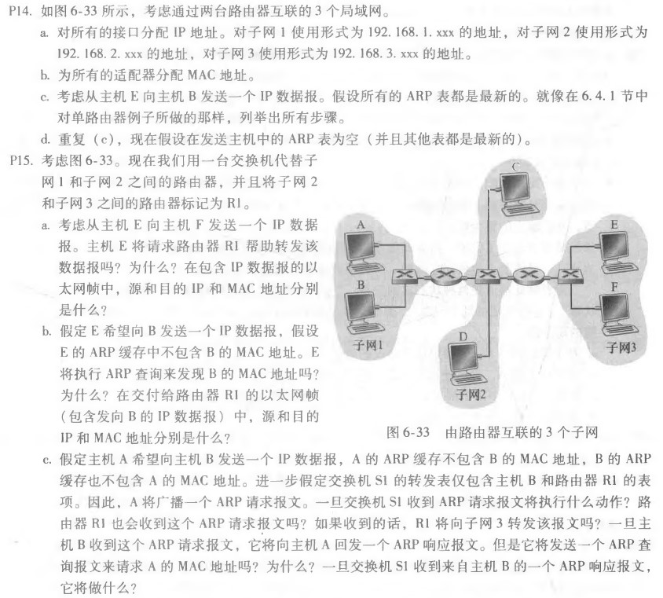
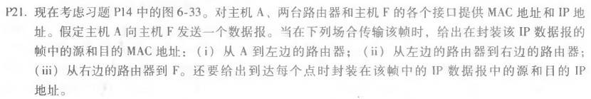

# 网络及分布式作业（十二）

[toc]

## 习题

### P14,P15

#### P14：

a.见下表 

b.见下表

各接口/适配器的IP地址、MAC地址可分配如下：

|     接口     |    地址     |      MAC地址      |
| :----------: | :---------: | :---------------: |
|      A       | 192.168.1.1 | 11-11-11-11-11-01 |
|      B       | 192.168.1.2 | 11-11-11-11-11-02 |
| Router1-LAN1 | 192.168.1.3 | 11-11-11-11-11-03 |
| Router1-LAN2 | 192.168.2.1 | 22-22-22-22-22-01 |
|      C       | 192.168.2.2 | 22-22-22-22-22-02 |
|      D       | 192.168.2.3 | 22-22-22-22-22-03 |
| Router2-LAN2 | 192.168.2.4 | 22-22-22-22-22-04 |
|      E       | 192.168.3.1 | 33-33-33-33-33-01 |
|      F       | 192.168.3.2 | 33-33-33-33-33-02 |
| Router2-LAN3 | 192.168.3.3 | 33-33-33-33-33-03 |

c. 

1. 主机E确定目标IP地址为192.168.1.2，其适配器创建目标MAC地址为33-33-33-33-33-03的帧。
2. 路由器2接收到来自主机E的以太网帧，根据转发表得知数据报应当被路由到192.168.2.1(路由器1与子网2的接口)。路由器2根据接收到的帧通过与子网2的接口创建目标mac地址为22-22-22-22-22-01的帧发送给路由器1。
3. 路由器1接收到路由器2传来的帧，根据转发表得知数据报应当被传送到192.168.1.2（目标主机B）。路由器1通过与子网1的接口创建Mac目标地址为11-11-11-11-11-02的帧发送给主机B。

d. 主机E会首先在子网内广播含ARP查询分组的帧，路由器向主机E反馈响应ARP分组。然后主机E按照（c）中的步骤发送数据。

#### P15：

a. 不会：当E更新ARP表时，主机F会发送相应的响应ARP分组。因此当E向F发送IP数据报时，目标MAC地址为F的MAC地址，交换机会直接将以太网帧转发给主机F

从E到F的以太网帧：

| 表项      | 内容                         |
| --------- | ---------------------------- |
| 源IP      | E的IP地址 192.168.3.1        |
| 目的地IP  | F的IP地址 192.168.3.2        |
| 源MAC     | E的MAC地址 33-33-33-33-33-01 |
| 目的地MAC | F的MAC地址 33-33-33-33-33-02 |

b. 不会，因为他们不在同一个局域网中，E将获得路由器R1与子网3的接口的MAC地址。

从E到B的以太网帧：

| 表项      | 内容                                        |
| --------- | ------------------------------------------- |
| 源IP      | E的IP地址 192.168.3.1                       |
| 目的地IP  | B的IP地址 192.168.1.2                       |
| 源MAC     | E的MAC地址 33-33-33-33-33-01                |
| 目的地MAC | R1与子网3的接口的MAC地址  33-33-33-33-33-03 |

c. 交换机S1将向主机B和R1发送以太网帧，因为接收到的ARP查询帧的目标地址是广播地址。此外，S1将更新它的转发表，添加主机A的条目。

会，路由器R1也会接收到这个ARP请求消息，但是R1不会将消息转发到子网3。

B不会发送ARP查询报文请求A的MAC地址，因为这个地址可以从A的查询消息中获得。

一旦交换机S1接收到B的响应消息，S1将会将ARP响应分组转发给主机A.

### P21

MAC地址与IP地址采用P14中的答案

|     接口     |    地址     |      MAC地址      |
| :----------: | :---------: | :---------------: |
|      A       | 192.168.1.1 | 11-11-11-11-11-01 |
|      B       | 192.168.1.2 | 11-11-11-11-11-02 |
| Router1-LAN1 | 192.168.1.3 | 11-11-11-11-11-03 |
| Router1-LAN2 | 192.168.2.1 | 22-22-22-22-22-01 |
|      C       | 192.168.2.2 | 22-22-22-22-22-02 |
|      D       | 192.168.2.3 | 22-22-22-22-22-03 |
| Router2-LAN2 | 192.168.2.4 | 22-22-22-22-22-04 |
|      E       | 192.168.3.1 | 33-33-33-33-33-01 |
|      F       | 192.168.3.2 | 33-33-33-33-33-02 |
| Router2-LAN3 | 192.168.3.3 | 33-33-33-33-33-03 |

i) 

| 表项      | 内容                                        |
| --------- | ------------------------------------------- |
| 源IP      | A的IP地址 192.168.1.1                       |
| 目的地IP  | R1与子网1的接口的IP地址 192.168.1.2         |
| 源MAC     | A的MAC地址 11-11-11-11-11-01                |
| 目的地MAC | R1与子网1的接口的MAC地址  11-11-11-11-11-03 |

ii) 

| 表项      | 内容                                        |
| --------- | ------------------------------------------- |
| 源IP      | R1与子网2的接口的IP地址  192.168.2.1        |
| 目的地IP  | R2与子网2的接口的IP地址 192.168.2.4         |
| 源MAC     | R1与子网2的接口的MAC地址 22-22-22-22-22-01  |
| 目的地MAC | R2与子网2的接口的MAC地址  22-22-22-22-22-04 |

iii)

| 表项       | 内容                                       |
| ---------- | ------------------------------------------ |
| 源IP       | R2与子网3的接口的IP地址 192.168.3.3        |
| 目的地IP   | F的IP地址 192.168.3.2                      |
| 源MAC      | R2与子网3的接口的MAC地址 33-33-33-33-33-03 |
| 目的地MACF | 的MAC地址  33-33-33-33-33-02               |