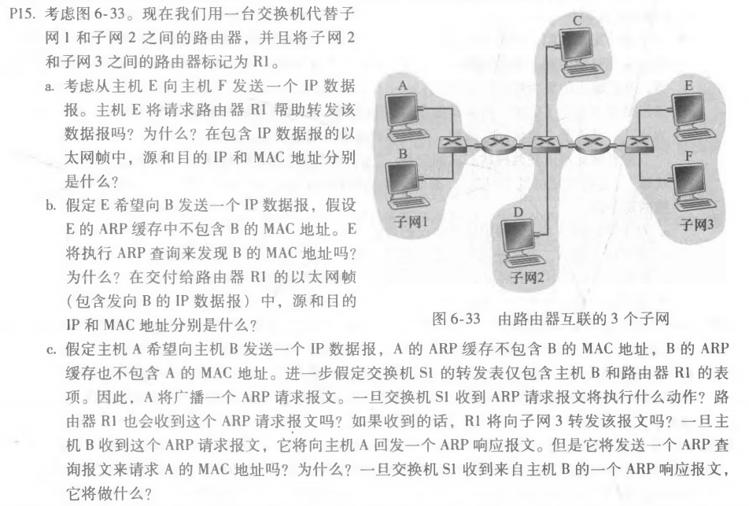
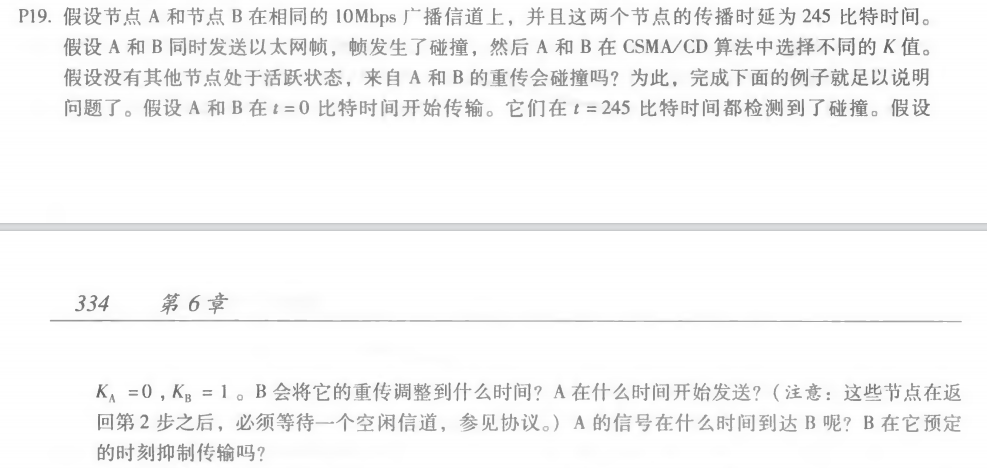
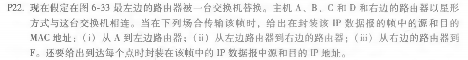

## P15

a)E与F在同⼀个局域⽹上。因此，E不会将数据包发送到默认路由器R1。 

从E到F的以太⽹帧： 

源IP=E的IP地址

⽬的地IP=F的IP地址

源MAC=E的MAC地址

⽬的地MAC=F的MAC地址

b)不会，因为它们不在同⼀个局域⽹上

从E到R1的以太⽹帧： 

源IP=E的IP地址

⽬的地IP=B的IP地址

源MAC=E的MAC地址

⽬的地MAC=连接到⼦⽹的R1接⼝的MAC地址。

c)交换机S1将通过两个接⼝⼴播以太⽹帧，因为接收到的ARP帧的⽬的地地址是⼴播地址。它了解到A驻留在连接到⼦⽹1的⼦⽹1上，并且S1将更新它的转发表以包括主机A的条⽬。 

是的，路由器R1也接收这个ARP请求消息，但是R1不会将消息转发到⼦⽹3。 

B不会发送请求A的MAC地址的ARP查询消息，因为这个地址可以从A的查询消息中获得。 

⼀旦交换机S1接收到B的响应消息，它将在其转发表中为主机B添加⼀个条⽬，然后删除接收到的帧，因为⽬的地主机A与主机B在同⼀个接⼝上(即A和B位于同⼀个LAN段上)。

## P19

| 时间t       | 事件                                          |
| ----------- | --------------------------------------------- |
| 0           | A和B开始传输                                  |
| 245         | A和B检测碰撞                                  |
| 293         | A和B结束拥塞信号传输                          |
| 293+245=538 | B的最后⼀⽐特到达A；A检测空闲线路             |
| 538+96=634  | A开始传输                                     |
| 293+512=805 | B返回到第⼆步                                 |
|             | B必须对空闲信道进⾏96 bit的检测，然后才能传输 |
| 634+245=879 | A的传送到达B                                  |

## P22

i) 从A到交换机： 源MAC地址：00-00-00-00-00-00

⽬的地MAC地址：55-55-55-55-55-55

源IP：111.111.111.001

⽬的地IP：133.333.333.003

ii) 从交换机到右路由器： 源MAC地址：00-00-00-00-00-00

⽬的地MAC地址: 55-55-55-55-55-55

源IP: 111.111.111.001

⽬的地IP: 133.333.333.003

iii) 从右路由器到F： 源MAC地址: 88-88-88-88-88-88

⽬的地MAC地址: 99-99-99-99-99-99

源IP: 111.111.111.001

⽬的地IP: 133.333.333.003

