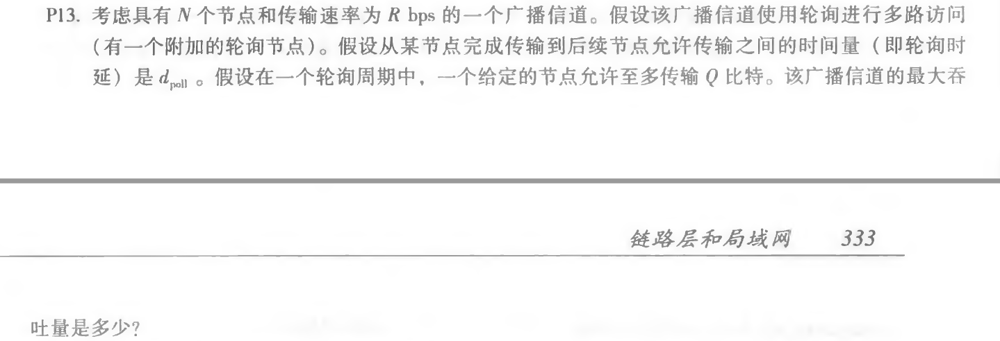
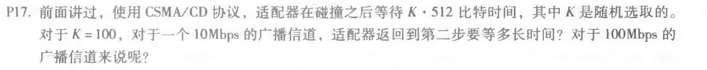
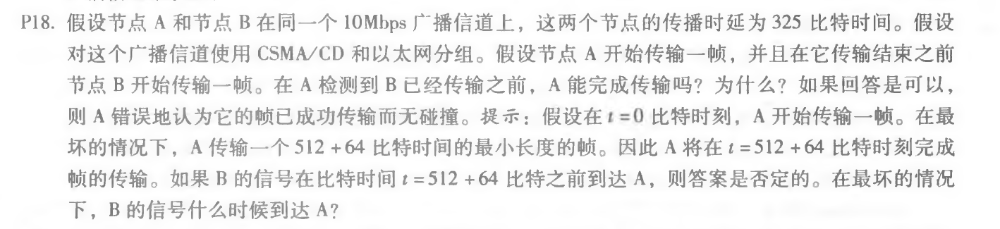

## Homework_12

**Author：**

姓名： 王泽生

学号：2017302580268

第六章习题：**P13、P17、P18**

注：查看公式正确形式，请使用 **Chrome** 浏览器并下载使用 **MathJax Plugin for Github** 插件

### P13

**解答：**

由题设得：
$$
ans = \frac {NQ} {N(Q/R + d_{poll})} = \frac {Q} {Q/R + d_{poll}}
$$
### P17

**解答：**

对于 10Mbps：
$$
wait = \frac {5.12 * 10^5bits}{10 * 10^6bps} = 5.12 * 10^{-3} s
$$
对于 100Mbps：
$$
wait = 5.12 * 10^{-4} s
$$

### P18

**解答：**

| 时间                | 事件           |
| ------------------- | -------------- |
| t = 0               | A 传输         |
| t = 324             | B 传输         |
| t = 576             | A完成传输      |
| t = 324 + 325 = 649 | B的第一位到达A |

649 > 576，A 在检测到 B 传输之前已经传输完成，A 会错误地以为它的帧传输成功了。

