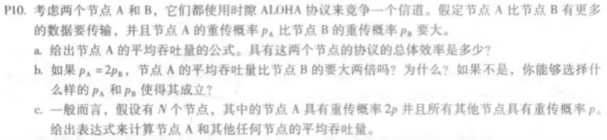
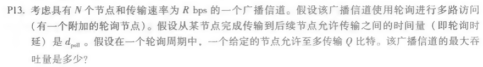
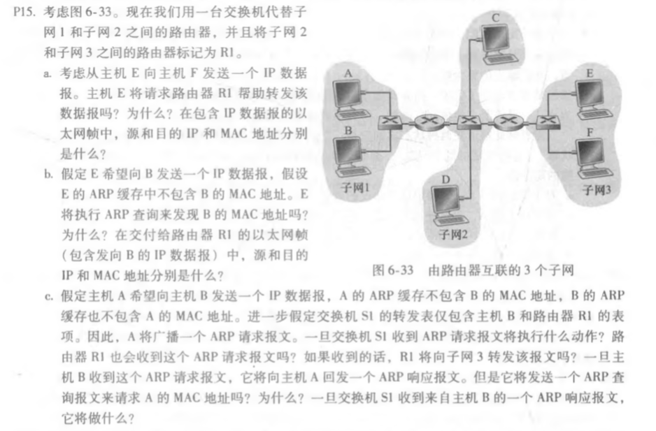
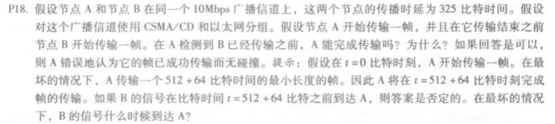

## 课后题

### P10

a. 节点A的平均吞吐量的公式为pA(1-pB)，效率为pA(1-pB)+pB(1-pA)

b. 节点A的平均吞吐量的公式为pA(1-pB)=2pB(1-pB)，节点B的平均吞吐量的公式为pB(1-2pB)，所以不大两倍。

​    pA(1-pB)=2pB(1-pA) -> pApB=2pB-pA

c. A的平均吞吐量为2p·(1-p)N-1，其他节点的平均吞吐量为(1-2p)·p·(1-p)N-2

### P13

依题意最大传输NQ比特，一个轮询周期的时间为N(Q/R + dpoll)，该广播信道的最大吞吐量是NQ/N(Q/R + dpoll)

### P15

a. 不用，因为E和F在同一个子网中，所以E向F发IP数据报没必要经过R1。源的IP和MAC是E的IP和MAC地址，目的的IP和MAC是F的IP和MAC地址。

b. 不会，因为B和E不在一个子网中，ARP只能为同一个子网的主机和路由器接口解析IP地址。源的IP和MAC地址是E的IP和MAC地址，目的的IP地址是B的IP地址，目的的MAC地址是R1(连接到子网3)的MAC地址。

c. S1收到ARP请求报文后它会广播所有帧，并且更新它的转发表的表项（添加A）。路由器R1（与子网2连接的接口）也会收到这个ARP请求报文，但是不会向子网三转发。B收到这个ARP请求报文，给A回发一个ARP响应报文，它不用发送一个ARP查询报文来请求A的MAC地址，因为这个地址可以从请求报文中获得。一旦交换机S1接收到B的ARP响应报文，它将在其转发表中更新B的表项，然后丢弃该帧。

### P18

​	最坏情况下B在324比特时间的时候开始传输，在324+325=649比特时间的时候B的第一个比特传到A，此时A已经传输完毕，会错误的认为传输已经完成且无碰撞。

