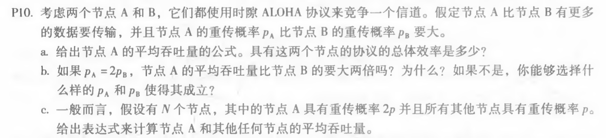
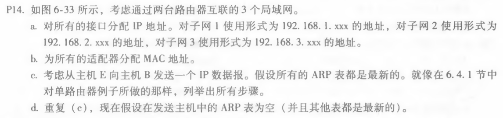
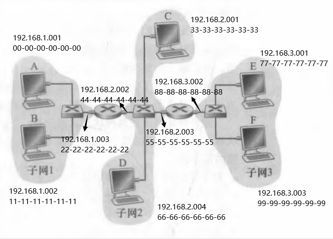
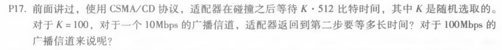

## *第十二次作业*

---------------------------------------------  
### 第六章习题  
#### P10  

#### 答：  
a.  
Pa(1-Pb)；Pa(1-pb)+Pb(1-pa)  
b.  
不，节点A：Pa(1-Pb)=2Pb(1-Pb)=2Pb-2Pb^2；而节点B：Pb(1-Pa)=Pb(1-2Pb)=Pb-2Pb^2。  
成立条件：Pa(1-Pb)=2*Pb(1-Pa) => PaPb+Pa-2Pb=0  
c.  
节点A：2p(1-p)^(N-1)  
其他节点：p(1-2p)(1-p)^(N-2)  
#### P14  

a.b.的答案直接写在图6-33上了。  
#### 答：  
a.b.  
  
c.  
E中的转发表确定数据报应传到接口192.168.3.002。E中的适配器创建一个以太网数据包，目的地地址为88-88-88-88-88-88-88。  
右边的路由器接收数据包并提取数据报，转发表指示数据报将被传到198.162.2.002。通过接口198.162.003发送目的地址为44-44-44-44-44-44、源地址为55-55-55-55-55-55-55-55-55-55的以太网分组。  
左边的路由器接受...重复过程,,,一直到数据包传到主机B。  
d.  
E中的ARP首先要确定198.162.3.002的MAC地址——主机E在广播以太网帧内发送ARP查询包。右边的路由器接收查询包并向主机E发送ARP响应包。  
E拿到MAC地址后的步骤就和（c）中一样了。  
#### P17  

#### 答:  
10Mbps：100*512 bits / 10Mbps = 5.12ms  
100Mbps：100*512 bits / 100Mbps = 0.512ms

