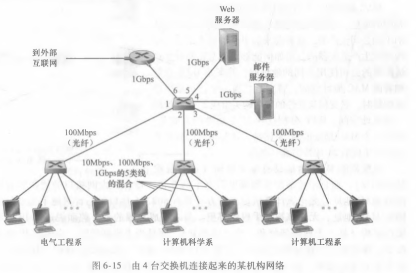
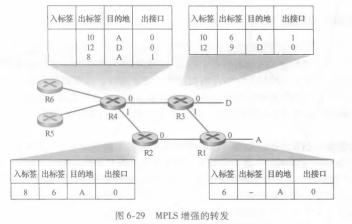

# HOMEWORK12

2017302580288 李沛昊

### P23

**问题：**考虑图6・15。假定所有链路都是100Mbps。在该网络中的9台主机和两台服务器之间，能够取得的 最大总 聚合吞吐量是多少？你能够假设任何主机或服务器能够向任何其他主机或服务器发送分组。 为什么? 

**解答：**

由于交换机是无碰撞的，因此最大聚合吞吐量等于所有节点的最大吞吐量之和=11*100Mbps=1100Mbps。

### P26

**问题：**.在某网络中标识为A到F的6个节点以星形与一台交换机连接，考虑在该网络环境中某个正在 学习的交换机的运行情况。假定：（i） B向E发送一个帧；（ii） E向B回答一个帧；（iii） A 向B发送一个帧；（iv） B向A回答一个帧“该交换机表初始为空。显示在这些事件的前后该 交换机表的状态。对于每个事件，指出在其上面转发传输的帧的链路，并简要地评价你的 答案。 

**解答：**

| 事件 | 状态                         | 转发链路      | 解释                                                         |
| ---- | ---------------------------- | ------------- | ------------------------------------------------------------ |
| B->E | 学习到B节点MAC地址对应的接口 | A、C、D、E、F | 因为交换机表为空，所以不知道E节点MAC地址对应的接口，因此广播该帧 |
| E->B | 学习到E节点MAC地址对应的接口 | B             | 因为交换机表中已经有B节点对应的接口                          |
| A->B | 学习到A节点MAC地址对应的接口 | B             | 因为交换机表中已经有B节点对应的接口                          |
| B->A | 交换机保持状态               | A             | 因为交换机表中已经有A节点对应的接口                          |

### P29

**问题：** 考虑显示在图6-29中的MPLS网络，假定路由器R5和R6现在是MPLS使能的。假定我们要执行流 量工程，使从R6发往A的分组要经R6-R4-R3-R1交换到A,从R5发向A的分组要过R5-R4-R2R1交换。给出R5和R6中的MPLS表以及在R4中修改的表，使得这些成为可能。 

**解答：**

R6：

| 入标签 | 出标签 | 目的地 | 出接口 |
| ------ | ------ | ------ | ------ |
|        | 1      | A      | 0      |

R5：

| 入标签 | 出标签 | 目的地 | 出接口 |
| ------ | ------ | ------ | ------ |
|        | 2      | A      | 0      |

R4：

| 入标签 | 出标签 | 目的地 | 出接口 |
| ------ | ------ | ------ | ------ |
| 1      | 10     | A      | 0      |
|        | 12     | D      | 0      |
| 2      | 8      | A      | 1      |