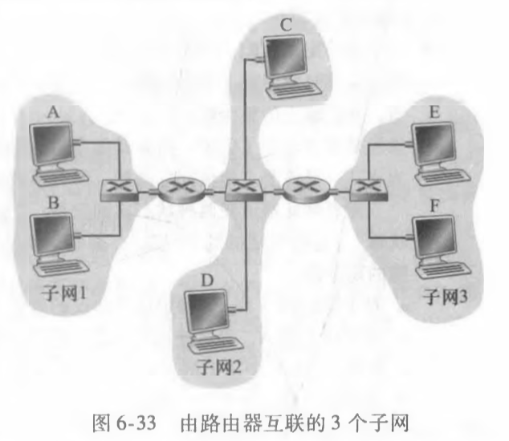
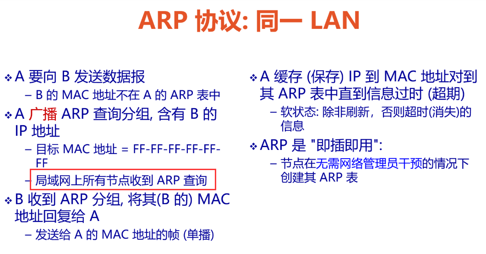
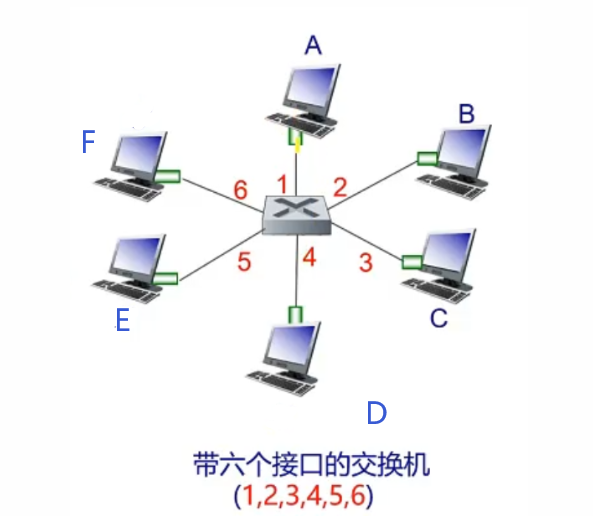

# Homework12

---

## 个人信息

- 班级：软工六班
- 学号：2017302580291
- 姓名：洪龙熙

---

## 作业

### 作业1

- 题目

> P15
>
> 考虑图6-33。
>
> 
>
> 现在我们用一台交换机代替子网 1 和子网 2 之间的路由器，并且将子网 2 和子网 3 之间的路由器标记为 R1。
>
> 1.  考虑从主机 E 向主机 F 发送一个 IP 数据报。主机 E 将请求路由器 R1 帮助转发该数据报吗？为什么？在包含 IP 数据报的以太网帧中，源和目的 IP 和 MAC 地址分别是什么？
> 2.  假定 E 希望向 B 发送一个 IP 数据报，假设 E 的 ARP 缓存中不包含 B 的 MAC 地址。E 将执行 ARP 查询来发现 B 的 MAC 地址吗？为什么？在交付给路由器 R1 的以太网帧（包含发向 B 的 IP 数据报）中，源和目的 IP 和 MAC 地址分别是什么？
> 3.  假定主机 A 希望向主机 B 发送一个 IP 数据报，A 的 ARP 缓存不包含 B 的 MAC 地址，B 的 ARP 缓存也不包含 A 的 MAC 地址。进一步假定交换机 S1 的转发表仅包含主机 B 和路由器 R1 的表项。因此，A 将广播一个 ARP 请求报文。一旦交换机 S1 收到 ARP 请求报文将执行什么动作？路由器 R1 也会收到这个 ARP 请求报文吗？如果收到的话，R1 将向子网 3 转发该报文吗？ 一旦主机 B 收到这个 ARP 请求报文，它将向主机 A 回发一个 ARP 响应报文。但是它将发送一个 ARP 查询报文来请求 A 的 MAC 地址吗？为什么？ 一旦交换机 S1 收到来自主机 B 的一个 ARP 响应报文，它将做什么？ 

-   答案

    1.  不会。一个局域网内，知道其他适配器的 IP 和 MAC。通过得知 F 的 IP 地址，知道在同一个子网内，所以不会。
    
        Source IP：E 的 IP 地址
    
        Source MAC：E 的 MAC 地址
    
        Destination IP：F 的 IP 地址
    
        Destination MAC：F 的 MAC 地址
    
    2.  不会。在知道 B 的 IP 地址后，知道其不在同一个子网内，故不会进行 ARP 查询
    
        Source IP：E 的 IP 地址
    
        Source MAC：E 的 MAC 地址
    
        Destination IP：B 的 IP 地址
    
        Destination MAC：R1 中连接子网 3 的适配器的 MAC 地址
    
    3.  S1 收到 ARP request 时将广播至所有节点，如课件所言：
    
        
    
        故 R1 也会收到该条广播信息。
    
        但 R1 不会转发该广播至子网3，因为 B 的 IP 地址和子网 IP 地址前缀不匹配。
    
        B 不会发送 ARP 请求报文。因为 ARP request 包含 A 的 MAC 地址。
    
        S1 收到后，会添加条目
    
        

### 作业2

- 题目

> P26
>
> 在某网络中标识为 A 到 F 的 6 个节点以星形与一台交换机连接，考虑在该网络环境中某个正在学习的交换机的运行情况。假定：
>
> （i） B 向 E 发送一个帧；
>
> （ii） E 向 B 回答一个帧；
>
> （iii） A 向 B 发送一个帧；
>
> （iv） B 向 A 回答一个帧。
>
> 该交换机表初始为空。显示在这些事件的前后该交换机表的状态。对于每个事件，指出在其上面转发传输的帧的链路，并简要地评价你的答案。 

-   答案

    

    1.  B 广播 ARP query，寻找 E 的 MAC 地址
    2.  交换机：增加条目，记录 B 的 MAC 地址，将广播发送至A、C、D、E、F 
    3.  A、C、D、F 收到后，丢弃；E 收到后，回应
    4.  交换机：增加条目，记录 E 的 MAC 地址，并将 ARP response 发至 B
    5.  A 广播 ARP query，寻找 B 的 MAC 地址
    6.  交换机：增加条目，记录 A 的 MAC 地址，将消息发送至 B，因为已经知道了 B 的 MAC 地址
    7.  C、D、E、F 收到后，丢弃，B 收到后，回应
    8.  交换机：将回应发给 A

    

    

### 作业3

- 题目

> P18
>
> 假设节点 A 和节点 B 在同一个 10Mbps 广播信道上，这两个节点的传播时延为 325 比特时间。假设对这个广播信道使用 CSMA/CD 和以太网分组。假设节点 A 开始传输一帧，并且在它传输结束之前节点 B 开始传输一帧。在 A 检测到 B 已经传输之前，A 能完成传输吗？为什么？如果回答是可以，则 A 错误地认为它的帧已成功传输而无碰撞。提示：假设在 t = 0 比特时刻，A 开始传输一帧。在最坏的情况下，A 传输一个 512+64 比特时间的最小长度的帧。因此 A 将在 t = 512 + 64 比特时刻完成帧的传输。如果 B 的信号在比特时间 t = 512 + 64 比特之前到达A，则答案是否定的。在最坏的情况下，B 的信号什么时候到达 A? 

-   答案

    t = 0，A 开始传输，并传播自己开始传输（t = 325 时，被 B 收到）

    t = 324，B 开始传输，并传播自己开始传输（t = 649 时，被 A 收到）

    t = 325，B 收到 A 开始传输的消息，并停止传输，发送干扰信号。但此时，信道已污染。（t = 650 时，被 A 收到）

    t = 576，A 传输完毕，发送完毕信号，但这并没有纯净的传输。

    t = 649，A 收到 B 的干扰信号。

    由此可见，A 能完成传输，但并不是纯净的传输，所以 A 会错误的认为以完成传输。

    
