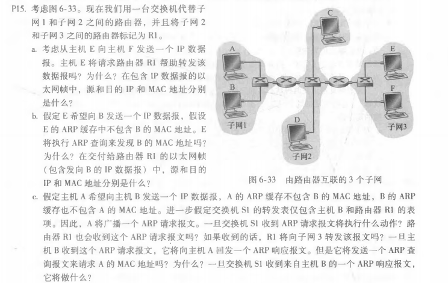
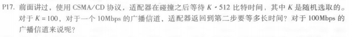

## P15
 
a.不会，E和F在同一个子网中。 
&nbsp;&nbsp;
源IP：E的IP；目的IP：F的IP&nbsp;
源MAC：E的MAC；目的MAC：F的MAC 
b.不会，E和B不在同一个子网中。 
&nbsp;&nbsp;
源IP：E的IP；目的IP：B的IP&nbsp;
源MAC：E的MAC；目的MAC：R1和子网3接口的MAC 
c.S1将继续广播。R1会收到但不会向子网3转发。B不会发送，它可以从A的报文中获得A的MAC地址。S1会在转发表中加入B的地址，并向A转发
## P16
 
（原有的R1更换为S2） 
a.不会，E和F在同一个子网中。 
&nbsp;&nbsp;
源IP：E的IP；目的IP：F的IP&nbsp;
源MAC：E的MAC；目的MAC：F的MAC 
b.会，E无法确定二者是否属于同一子网 
&nbsp;&nbsp;
源IP：E的IP；目的IP：B的IP&nbsp;
源MAC：E的MAC；目的MAC：广播地址FF-FF-FF-FF-FF-FF 
c.S1将继续广播。S2会收到并向子网3广播。B不会发送，它可以从A的报文中获得A的MAC地址。S1会在转发表中加入B的地址，并向A转发
## P17
 
1.&nbsp;10Mbps：(100\*512)/10^7=5.12\*10^-3(s)=5.12ms 
2.&nbsp;100Mbps:(100\*512)/10^8=5.12\*10^-4(s)=0.512ms

 

 
刘涛 2017302580292 2020.06.04
