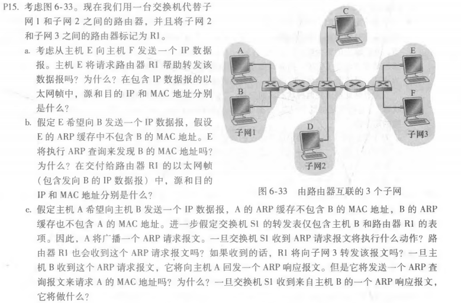
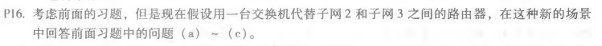
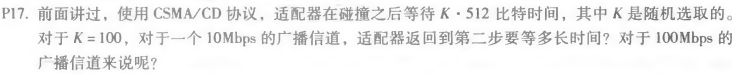

# 第十二次作业
## 刘洋 2017302580294
P15: 
（a）、不需要请求路由器R1，因为二者在同一子网当中。 
源IP地址：E的IP地址 
目的IP地址：F的IP地址 
源MAC地址：E的MAC地址 
目的MAC地址：F的MAC地址 
（b）、不进行ARP查询，因为E和B不在同一子网下。 
源IP地址：E的IP地址 
目的IP地址：B的IP地址 
源MAC地址：E的MAC地址 
目的MAC地址：E与子网3接口的MAC地址 
（c）、S1将继续广播 
R1会收到ARP请求报文 
R1不会向子网3转发该报文 
B不会发送ARP查询报文,因为它从A发送的查询报文中可以获得A的MAC地址 
S1将在转发表中加入B的地址，并向A转发该报文。 

P16: 
（a）、不需要请求路由器R1，因为二者在同一子网当中。 
源IP地址：E的IP地址 
目的IP地址：F的IP地址 
源MAC地址：E的MAC地址 
目的MAC地址：F的MAC地址 
（b）、进行ARP查询，因为E不知道B在不在同一子网下。 
源IP地址：E的IP地址 
目的IP地址：B的IP地址 
源MAC地址：E的MAC地址 
目的MAC地址：FF-FF-FF-FF-FF-FF 
（c）、S1将继续广播 
R1会收到ARP请求报文 
新加入的交换机会向子网3广播报文 
B不会发送ARP查询报文,因为它从A发送的查询报文中可以获得A的MAC地址 
S1将在转发表中加入B的地址，并向A转发该报文。 

P17: 
（512*100）/（10*1000000）=5.12ms 
（512*100）/（100*1000000）=0.512ms