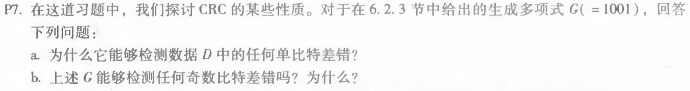
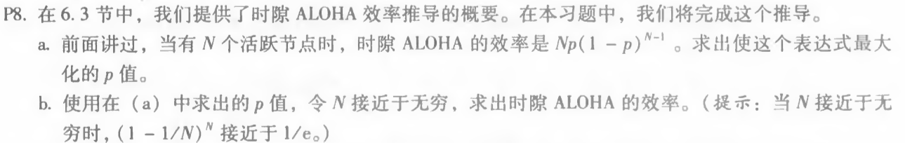
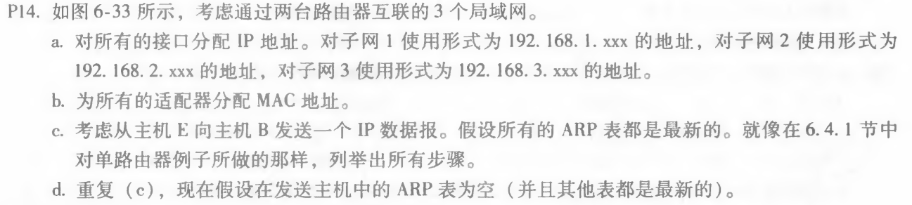
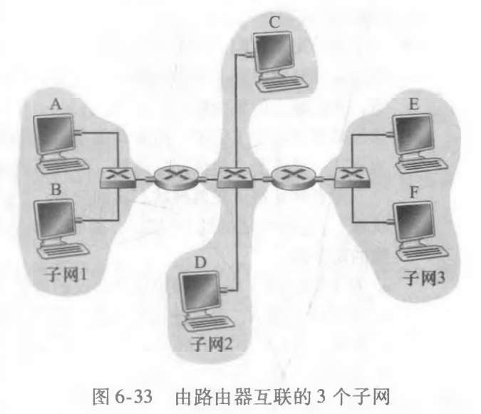

#### 1. P7

a. 因为对于循环冗余监测编码，$D * 2^r = nG XOR R$，所得的的余数不为零代表出现差错。而G = 1001中包含两个1，那么当D中发生任何单比特的错误时，G一定能够检测出来。

b. 不能，G只能检测小于 r + 1比特的错误，当奇数比特的错误超过 r 时，G不能检测出来。

#### 2. P8

a. 由当时隙ALOHA的效率得到最大时，求导得：
$$
(Np(1-p)^{N-1})' = N(1-p)^{N - 1} - Np(N - 1)(1 - p)^{N-2} \\
= N(1-p)^{N- 2}(1- Np)
$$
所以当$(Np(1-p)^{N-1})' = 0$时，有p = 1/N

b. 将p = 1/N 代入得：

时隙ALOHA效率为：
$$
(1- 1/N)^{N-1}
$$
则当N趋于无穷大时，得到表达式极限值为1/e

#### 3. P14

a. 分配的IP地址如下：

主机A：192.168.1.1

主机B：192.168.1.2

子网1交换机：192.168.1.3

主机C：192.168.2.1

主机D：192.168.2.2

子网2交换机：192.168.2.3

主机E：192.168.3.1

主机F：192.168.3.2

子网3交换机：192.168.3.3

b. 分配的MAC地址为：

主机A：00-00-00-00-00-01

主机B：00-00-00-00-00-02

子网1交换机：00-00-00-00-00-03

主机C：00-00-00-00-00-04

主机D：00-00-00-00-00-05

子网2交换机：00-00-00-00-00-06

主机E：00-00-00-00-00-07

主机F：00-00-00-00-00-08

子网3交换机：00-00-00-00-00-09

c. 步骤如下：

1. 主机E中转发表确认路由接口192.168.3.3

2. 主机E创建目的地址的以太网数据接口00-00-00-00-00-09

3. 路由器接收数据包并转发至192.168.2.3

4. 创建目的地址的以太网数据接口00-00-00-00-00-03

5. 路由器接收数据包并转发至192.168.1.3

6. 创建目的地址的以太网数据接口00-00-00-00-00-02

7. 路由器接收数据包并转发至192.168.1.2

8. 主机B接收

d. 当发送主机中的ARP表为空时，主机必须首先确认192.168.3.3的Mac地址，主机E发送ARP查询包，当接收到响应之后再重复上述步骤。

