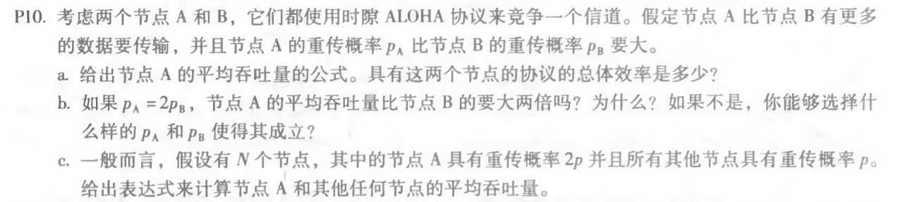
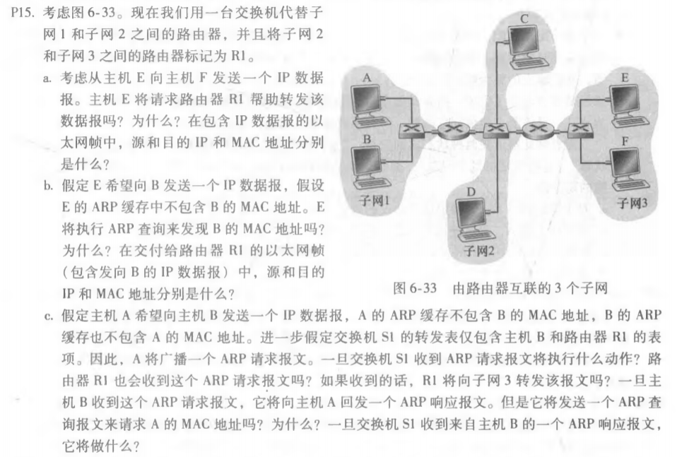
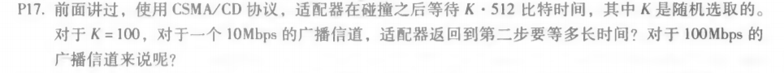

# 第十二次作业

徐意 2017312580048

## 课后习题

### P10



```
a)
A的平均吞吐量：PA(1-PB)。
总效率：PA(1-PB)+PB(1-PA)。

b)
PA=2Pb
A的吞吐量：PA(1-PB)=2PB(1-PB)=2PB−2PB^2
B的吞吐量：PB(1-PA)=PB(1-2PB)=PB-2PB^2
由上得不是大两倍。
大两倍的情况：
2PB−2PB^2 = (PB-2PB^2)*3
得PB=1/4
则PA=1/2

c)
A的吞吐量：2p(1−p)^(N-1)，
任何其他节点的吞吐量：p(1-2p)(1-p)^(N-2)
```

### P15



```
a)
否。E可以检查主机F的IP地址的子网前缀，然后了解F在同一个局域网上。因此，E不会将数据包发送到默认路由器R1。
从E到F的以太网帧：
源IP=E的IP地址
目的地IP=F的IP地址
源MAC=E的MAC地址
目的地MAC=F的MAC地址

b)
不，因为它们不在同一个局域网上。E可以通过检查B的IP地址来发现这一点。
从E到R1的以太网帧：
源IP=E的IP地址
目的地IP=B的IP地址
源MAC=E的MAC地址
目的地MAC=连接到子网的R1接口的MAC地址。

c)
交换机S1将通过两个接口广播以太网帧，因为接收到的ARP帧的目的地地址是广播地址。它了解到A驻留在连接到子网1的子网1上，并且S1将更新它的转发表以包括主机A的条目。

是的，路由器R1也接收这个ARP请求消息，但是R1不会将消息转发到子网3。

B不会发送请求A的MAC地址的ARP查询消息，因为这个地址可以从A的查询消息中获得。

一旦交换机S1接收到B的响应消息，它将在其转发表中为主机B添加一个条目，然后删除接收到的帧，因为目的地主机A与主机B在同一个接口上(即A和B位于同一个LAN段上)。
```

### P17



```
对于10mbps：
100 * 512bit / 10mbps = 5.12ms

对于100mbps：
100 * 512bit / 100mbps = 512μs
```


