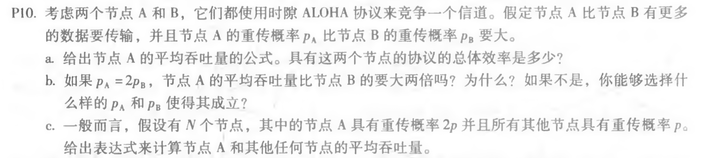
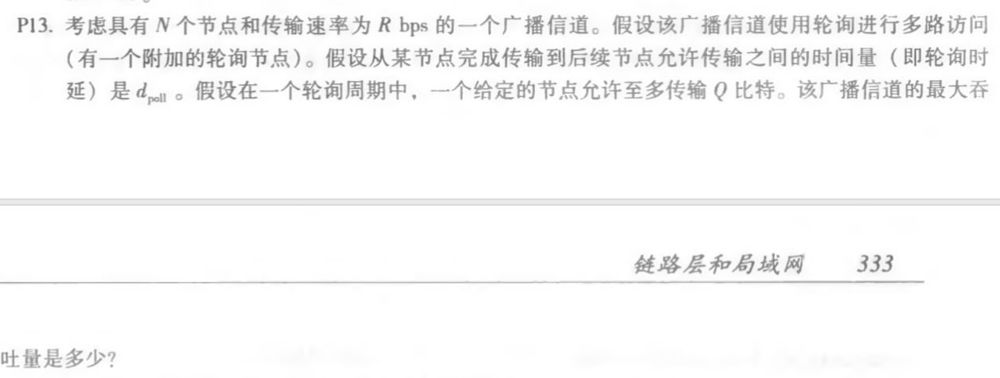
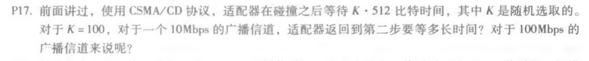

# 第十二次作业
## 第六章课后3道题
### p10

#### 答：
a. 
A的平均吞吐量：pA(1−pB)
总体效率：pA(1−pB)+pB(1−pA)
b.
节点A没有比节点B大2倍，上式即可验证这一点；
成立：pA ,pB须满足方程pA+pApB−2pB=0
c.
TA=2p[(1−p)^N−1]
Tothers=[p(1−p)^N−2] (1−2p)

### p13

#### 答：
一个周期的时间：N(Q/R+dpoll)
一个周期的传输量：NQ
最大吞吐量：NQ/[N(Q/R+dpoll)]=Q/(Q/R+dpoll)

### p17

#### 答：
10Mbps:100∗512/(10∗10^6)=5.12ms
100Mbps:0.512ms
